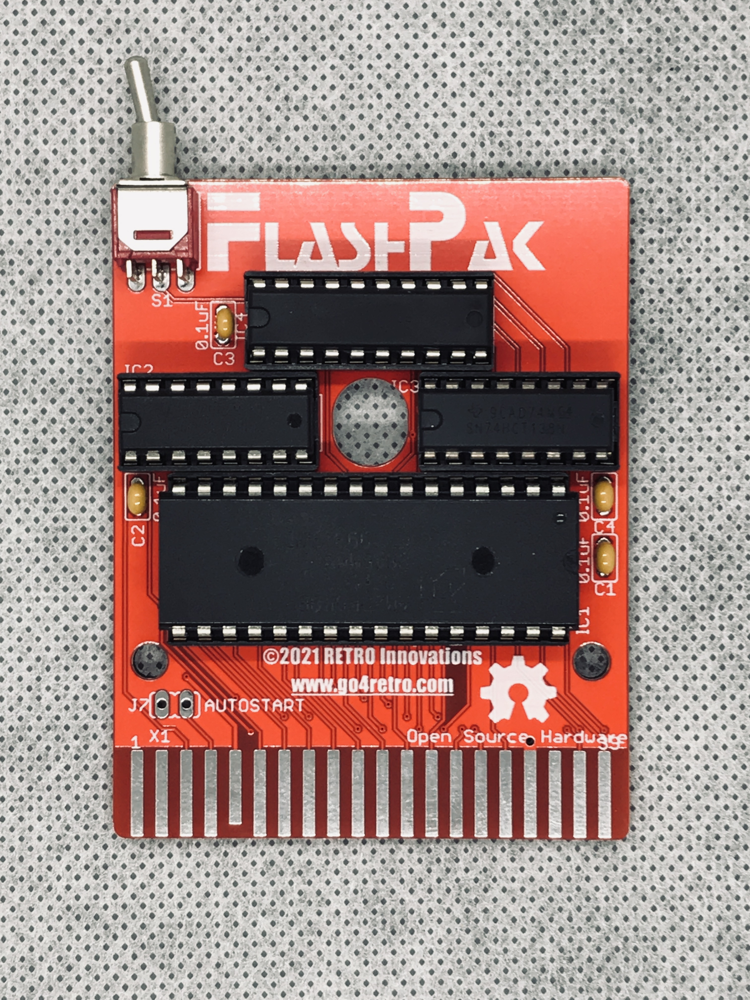
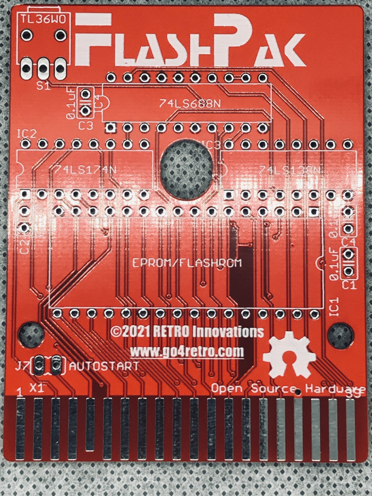
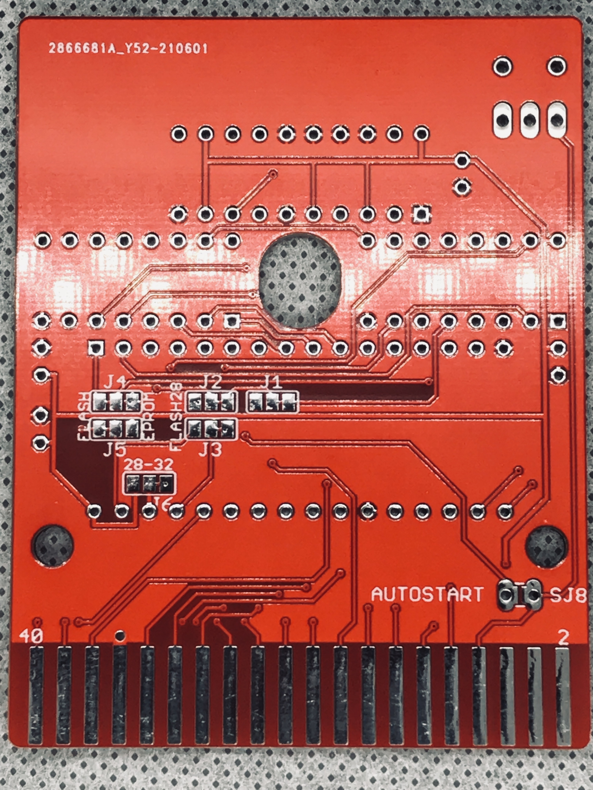

# FlashPak - 512kB FLASH ROM Cartridge Unit for the TANDY Color Computer 1, 2, 3, and Dragon

This cartridge supports 512kB of system programmable FLASH ROM utilizing the RoboCop (Zumwalt) banking system.

## Technical Details
Banks are 16kB in size (technically, 16KiB - 256 bytes, since $ff00-$ffff is reserved for IO and vectors), which allows operation on all TANDY Color Computer models and the Dragon Data Dragon machines.  FLASH ROM appears at location $c000 in the memory map, while the banking register appears at $ff40.  The bits in the banking register are as follows:

| IO Location | Bit Location | Description                 |
| ----------- | ------------ | --------------------------- |
| $ff40       | 4:0          | FLASH address lines A18-A14 |
|             | 7            | 1 = Programming Enabled     |

The system is designed to utilize AM29F040B FLASH ROMs, but can also accommodate 16kB-512kB FLASH ROMs or EPROMs via J1-J5.  Please see schematic for more details.  If EPROMs are utilized, IC3 is not required (EPROMs cannot be system programmable)

To program please consult the AM29F040B datasheet for details, but essentially:

* set bit 7 to 1 and select bank in bank register
* via machine language, store the following values:
* store $aa in $c555
* store $55 in $c2aa
* store $a0 in $c555
* store desired value in $c000-$feff address ($fdff on Color Computer 3, I believe)

Sample stub code is available in the src/ directory.  The programming must be precise and cannot easily be performed from BASIC[1].

[1]: To simplify construction and reduce cost, programming is enabled for all of $c000-$ffff.  This includes the entire $ffxx IO region.  Unless care is taken to disable BASIC or the IRQ handlers from accessing $ffxx regions while sending the special programming sequence, the sequence will be disrupted and programming will not occur.

## Photos

## License
Copyright (C) 2021  RETRO Innovations

These files are free designs; you can redistribute them and/or modify
them under the terms of the Creative Commons Attribution-ShareAlike 
4.0 International License.

You should have received a copy of the license along with this
work. If not, see <http://creativecommons.org/licenses/by-sa/4.0/>.

These files are distributed in the hope that they will be useful,
but WITHOUT ANY WARRANTY; without even the implied warranty of
MERCHANTABILITY or FITNESS FOR A PARTICULAR PURPOSE.  See the
license for more details.